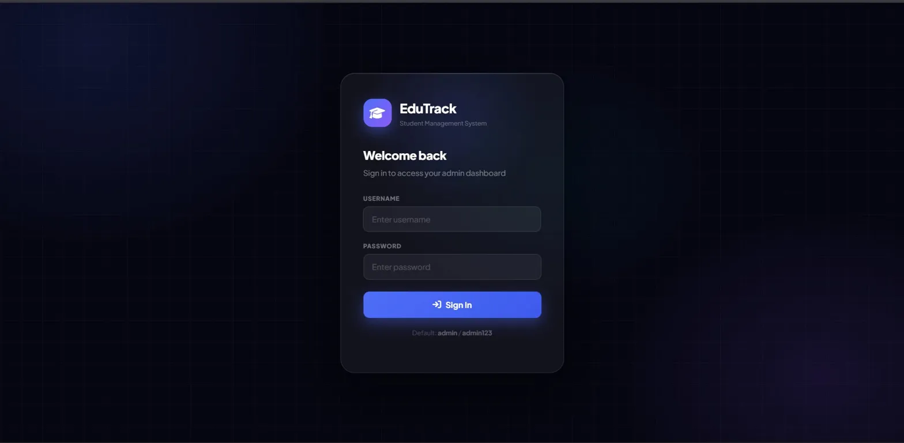
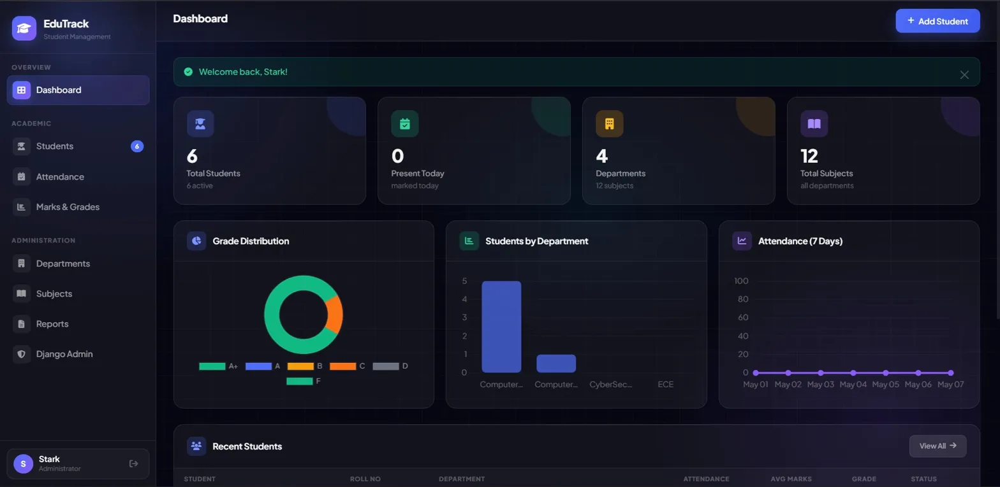
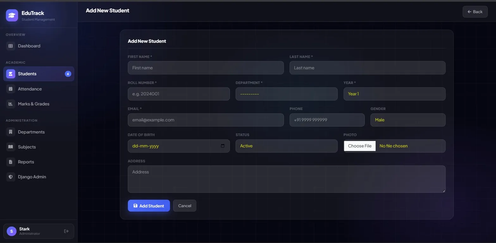
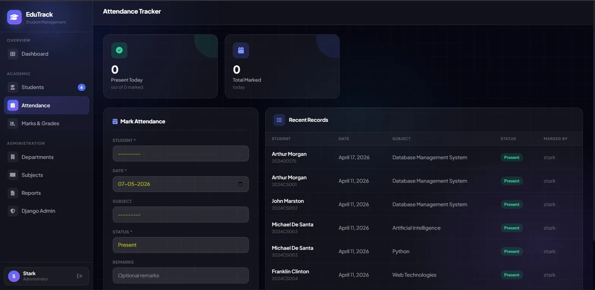
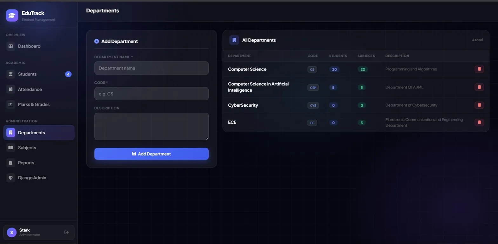

<div align="center">


# 🎓 EduTrack — Student Management System

**A full-stack Django web application for managing student records, attendance, marks, departments, and academic reports — with a clean dark-themed UI.**

[](https://student-managment-system-2-6qlo.onrender.com)
[](https://djangoproject.com)
[](https://python.org)
[](https://render.com)

</div>

---

## 🌐 Live Demo

> **URL:** [https://student-managment-system-2-6qlo.onrender.com](https://student-managment-system-2-6qlo.onrender.com)
>
> **Default Credentials:**
> | Field | Value |
> |-------|-------|
> | Username | `admin` |
> | Password | `admin123` |

> ⚠️ *Hosted on Render's free tier — may take ~30 seconds to wake up on first load.*

---

## 📸 Screenshots

### 🔐 Login Page
> Sleek dark-themed login with EduTrack branding and default credentials hint.



---

### 📊 Admin Dashboard
> Stats overview with live Chart.js graphs — Grade Distribution, Students by Department, and 7-Day Attendance Trend.



---

### 👨‍🎓 Add New Student
> Comprehensive student registration form — name, roll number, department, year, photo upload, and more.



---

### 📅 Attendance Tracker
> Mark and track student attendance per subject and date with recent records table.



---

### 🏫 Department Management
> Create and manage academic departments with live student and subject counts.



---

## ✨ Features

| Module | What It Does |
|--------|-------------|
| 🔐 **Auth System** | Secure Django login — admin-only access |
| 📊 **Dashboard** | Stats cards + Chart.js graphs (grades, departments, 7-day attendance trend) |
| 👨‍🎓 **Student CRUD** | Add, edit, view, delete students with photo upload support |
| 🔍 **Search & Filter** | Filter by name, roll number, department, year, or status |
| 📅 **Attendance** | Mark present/absent/leave per student, subject, and date |
| 📝 **Marks & Grades** | Per-subject marks with auto grade calculation (A+/A/B/C/D/F) |
| 🏫 **Departments** | Create and manage academic departments |
| 📚 **Subjects** | Assign subjects to departments with credit management |
| 📄 **Reports** | Full student report with attendance bars and grade summary |
| 📥 **CSV Export** | Download all student data as a CSV file |
| 🛡️ **Django Admin** | Full admin panel at `/admin/` |

---

## 🔧 Tech Stack

| Layer | Technology |
|-------|-----------|
| **Backend** | Python 3.x + Django 4.2 |
| **Frontend** | HTML5, CSS3, Custom Dark Theme, Chart.js |
| **Database** | SQLite (dev) / PostgreSQL (prod) |
| **Auth** | Django built-in authentication |
| **Deployment** | Render (cloud hosting) |

---

## 🚀 Local Setup

### Prerequisites
- Python 3.8+
- pip

### Quick Start (One Command)
```bash
python setup.py
python manage.py runserver
```
Then open **http://127.0.0.1:8000/** and login with `admin / admin123`

### Manual Setup

```bash
# 1. Clone the repository
git clone https://github.com/Shabazshiek/student-management-system.git
cd student-management-system

# 2. Install dependencies
pip install -r requirements.txt

# 3. Apply migrations
python manage.py makemigrations
python manage.py migrate

# 4. Seed sample data (auto-creates admin/admin123)
python manage.py seed_data

# 5. Run the server
python manage.py runserver
```

---

## 🗄️ Database Models

```
Student      → roll_number, name, email, phone, gender, dob, department, year, photo, status
Department   → name, code, description
Subject      → name, code, department, max_marks, credits
Attendance   → student, date, status (present/absent/leave), subject, marked_by
Marks        → student, subject, exam_type, marks_obtained, max_marks, exam_date
```

---

## 📁 Project Structure

```
sms/
├── manage.py                   # Django management script
├── setup.py                    # One-click setup
├── requirements.txt
├── sms_project/                # Django project config
│   ├── settings.py
│   ├── urls.py
│   └── wsgi.py
└── students/                   # Main application
    ├── models.py               # All DB models
    ├── views.py                # Page views & logic
    ├── urls.py                 # URL routes
    ├── forms.py                # Django forms
    ├── admin.py
    ├── context_processors.py
    ├── management/commands/
    │   └── seed_data.py        # Sample data seeder
    └── templates/students/
        ├── dashboard.html
        ├── student_list.html
        ├── attendance.html
        ├── marks.html
        ├── departments.html
        └── reports.html
```

---

## 📜 URL Routes

| URL | Page |
|-----|------|
| `/` | Dashboard |
| `/login/` | Login |
| `/students/` | Student List |
| `/students/add/` | Add Student |
| `/students/<id>/` | Student Profile |
| `/students/<id>/edit/` | Edit Student |
| `/attendance/` | Attendance Tracker |
| `/marks/` | Marks & Grades |
| `/departments/` | Departments |
| `/subjects/` | Subjects |
| `/reports/` | Reports |
| `/reports/export/` | CSV Export |
| `/admin/` | Django Admin |

---

## 🔁 Switch to PostgreSQL (Production)

In `sms_project/settings.py`:

```python
DATABASES = {
    'default': {
        'ENGINE': 'django.db.backends.postgresql',
        'NAME': 'sms_db',
        'USER': 'your_db_user',
        'PASSWORD': 'your_db_password',
        'HOST': 'localhost',
        'PORT': '5432',
    }
}
```

```bash
pip install psycopg2-binary
```

---

## 🗺️ Planned Improvements

- [ ] Role-based access control (Teacher / Student / Admin)
- [ ] AI-based student performance insights
- [ ] Real-time notification system
- [ ] REST API with Django REST Framework
- [ ] Mobile-responsive improvements

---

## 👨‍💻 Author

**Shabaz (Stark)**  
Computer Science Student | Django Developer | AI Enthusiast

[](https://github.com/Shabazshiek)
[](https://www.linkedin.com/in/sharfuddin-shaik/)

---

⭐ Support

If you like this project, consider giving it a ⭐ on GitHub 😄

---

<div align="center">
  <sub>Built with ❤️ using Django & Custom CSS · Deployed on Render</sub>
</div>
